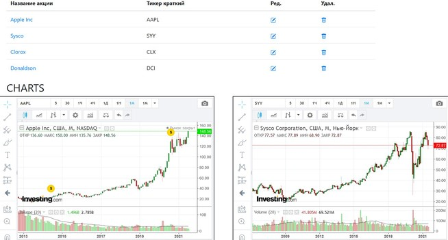

# 📈  Stock Visor

It's easy way to track your stocks in one place!

---

Позволяет удобно просматривать графики акций на одной странице. 

Чтобы добавить новую акцию, вставьте ее тикер и инструмент будет найден автоматически.

## Как установить:
1. Скачать проект
2. Создать базу данных и изменить ее в application.properties
3. spring.jpa.hibernate.ddl-auto выставить create. После первого запуска сменить на update
4. Готово

## Как пользоваться:
1. Зайти на сайт investing.com
2. Выбрать интересующую вас акцию, например Ford
3. Скопировать из адресной строки браузера полный тикер акции: ford-motor-co
4. Открыть Stock Visor и создать портфель   
4. Перейти в портфель и добавить скопированный тикер в скриннер.  
5. Готово

## Можно настроить:
1. Размеры графиков (ширина и высота)
2. Временной интервал графиков
3. Тип свечей

## Возможности:
1. Создание неограниченного количество портфелей.
2. В каждый портфель можно поместить столько акций, сколько вам требуется.

Планирую добавить сортировку инструментов, с возможностью перемещения графиков в зависимости от приоритета.

## License

Apache License 2.0

Unless required by applicable law or agreed to in writing, software
distributed under the License is distributed on an "AS IS" BASIS,
WITHOUT WARRANTIES OR CONDITIONS OF ANY KIND, either express or implied.
See the License for the specific language governing permissions and
limitations under the License.